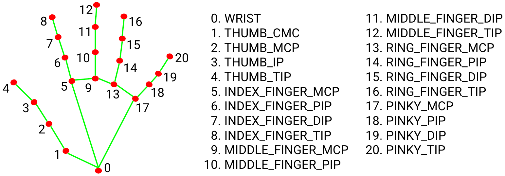
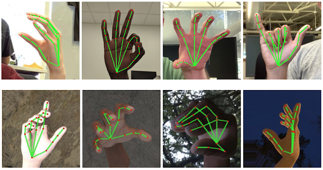

# ✍️ AirInk — Draw Letters in the Air, Build Words in Real Time

> **Paint and type in mid-air using only your hand!**  
> Draw letters with your index finger, recognize them with a gesture, and build full words — all in real time using your webcam.

---

## 🚀 Features

- 🖐 **Real-time hand tracking** — 21-point landmark detection via MediaPipe
- ✏️ **Air Drawing** — draw freely using your index finger
- 🎨 **4 Colour Brushes** — Purple, Blue, Green + Eraser (select from header bar)
- 🔤 **Letter Recognition** — OCR detects what letter you drew (powered by Tesseract)
- 🗒️ **Word Builder** — recognized letters accumulate into a full word displayed on screen
- 💡 **Flash feedback** — big animated letter pops up each time a letter is recognized
- ⚡ **FPS counter** — live performance display

---


## 🤚 Gesture Guide

| Gesture | Action |
|---|---|
| ☝️ **Index finger only** | Draw on the canvas |
| ✌️ **Index + Middle fingers** | Switch to selection mode — move hand to top bar to pick a colour |
| 🖐️ **All 5 fingers open** | **Recognize the drawn letter** → adds it to the word |
| `Space` key | Insert a space (start a new word) |
| `Backspace` key | Delete the last recognized letter |
| `C` key | Clear the entire word and canvas |
| `Q` key | Quit the app |

---

## 🔤 How to Type a Word (Step-by-Step)

```
1. Draw the letter "K" in the air with your index finger
2. Open all 5 fingers  →  "K" is recognized, flashes on screen, added to word bar
3. Canvas clears automatically
4. Draw the letter "A"  →  5 fingers  →  word bar shows "KA"
5. Draw the letter "T"  →  5 fingers  →  word bar shows "KAT"
6. Press SPACE to add a gap, then continue drawing the next word
```

The growing word is always visible in the **bottom bar** of the window, with each letter shown in the colour it was drawn with.

---

## 🧠 How It Works

### Hand Detection (MediaPipe)

MediaPipe's hand solution detects 21 3D landmarks per hand in real time.



Key landmarks used:
- **Landmark 8** — Index finger tip (drawing point)
- **Landmark 12** — Middle finger tip (selection mode detection)
- **Landmarks 4–20** — All fingertips (used in `fingersUp()` for gesture detection)

### Letter Recognition (Tesseract OCR)

When the 5-finger gesture is detected:
1. The drawn canvas is converted to **grayscale**
2. The letter region is **cropped** using bounding box detection
3. Image is **upscaled** and **inverted** (black letter on white background)
4. Passed to **Tesseract** in single-character mode (`--psm 10`)
5. Result is appended to the **word buffer** and displayed

### Canvas Blending

Each frame, the drawn canvas is blended onto the live camera feed using:
```python
frame = cv.bitwise_and(frame, canvasInv)   # cut out letter shape from frame
frame = cv.bitwise_or(frame, canvas)       # paste coloured strokes on top
```

---

## 📸 Output

> Letter recognition in action — the recognized letter flashes big on screen, then appears in the word bar at the bottom.



---

## ⚙️ Configuration

Edit these constants at the top of `Augmented_Hand_Drawing.py`:

| Constant | Default | Description |
|---|---|---|
| `BrushThickness` | `18` | Brush stroke width |
| `EraserThickness` | `100` | Eraser width |
| `RECOGNIZE_COOLDOWN` | `1.5s` | Min time between recognitions |
| `headerH` | `125` | Height of the colour picker bar |

---

## 📦 Dependencies & Compatibility

- Tested on **Windows 10/11**
- Python **3.9 – 3.11** recommended
- MediaPipe `0.10.x` (uses new Tasks API — `mp.solutions.hands` is **not** used)


## 📄 License

MIT License — free to use, modify and distribute.

---

<div align="center">

Made with ❤️ by **Kaushal Jindal**

</div>
